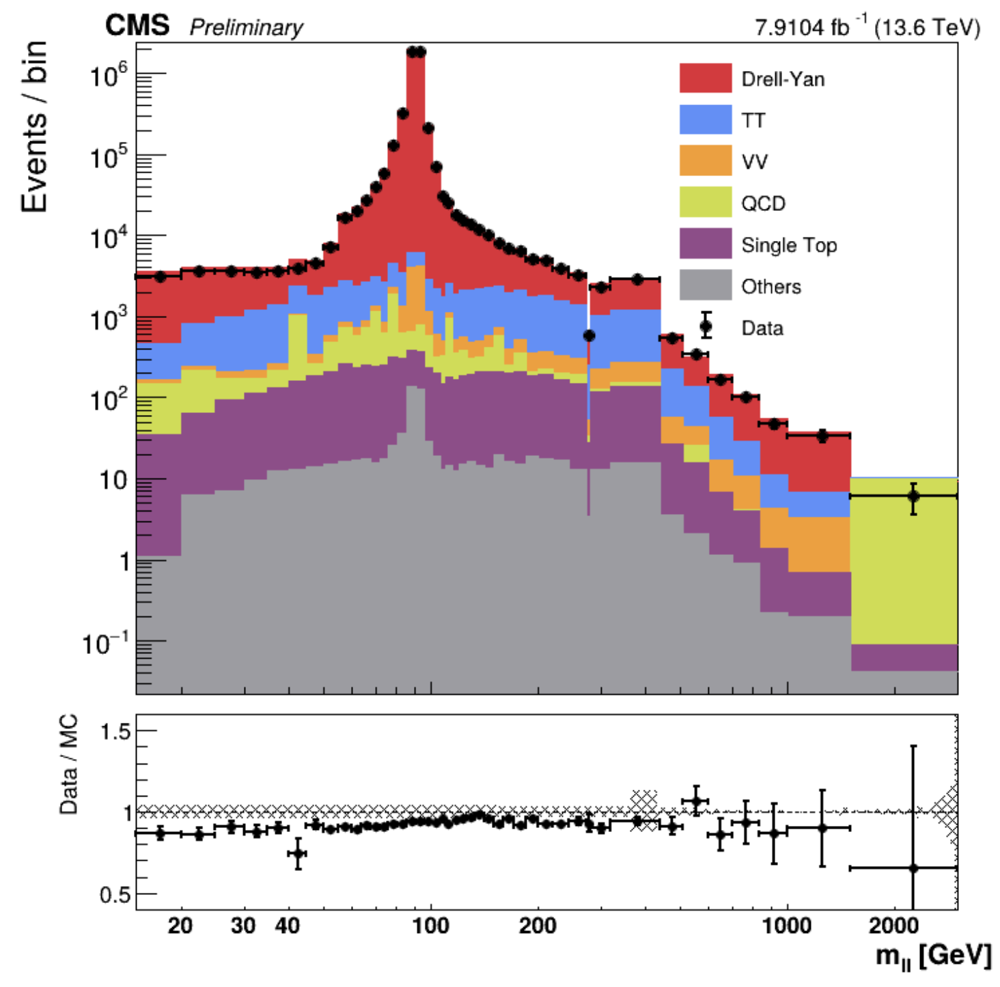

# DATA/SIM

실험 데이터와 Monte Carlo 시뮬레이션 간의 차이점과 보정 방법을 다룹니다.

## Drell Yan ( Z -> mu mu )

### Selections 
- HLT : Isomu24
- safeptcut : 26
- ID : POGTIGHT
- pt/eta cut : 30 / 2.4 
- leading , subleading muon , opposite charge 
- Not overlapped each other

*Results*
[2022 C,D ERA]

*Reference results*

- SMP 16-009
