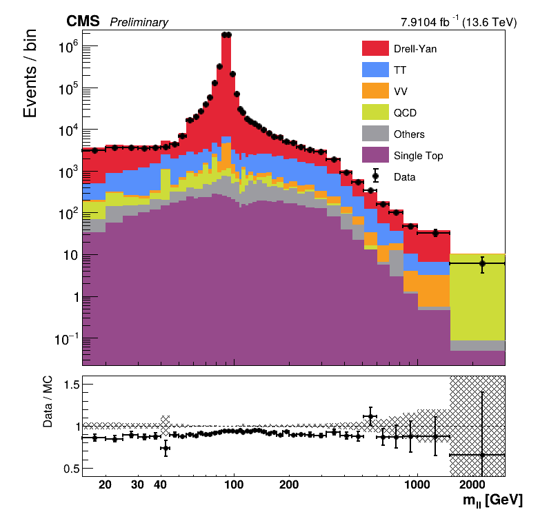
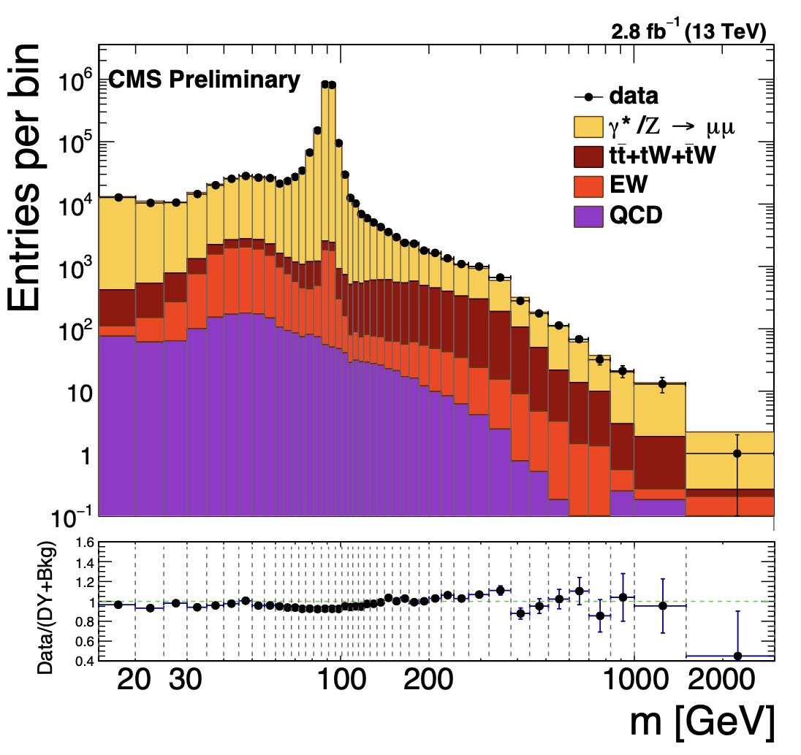
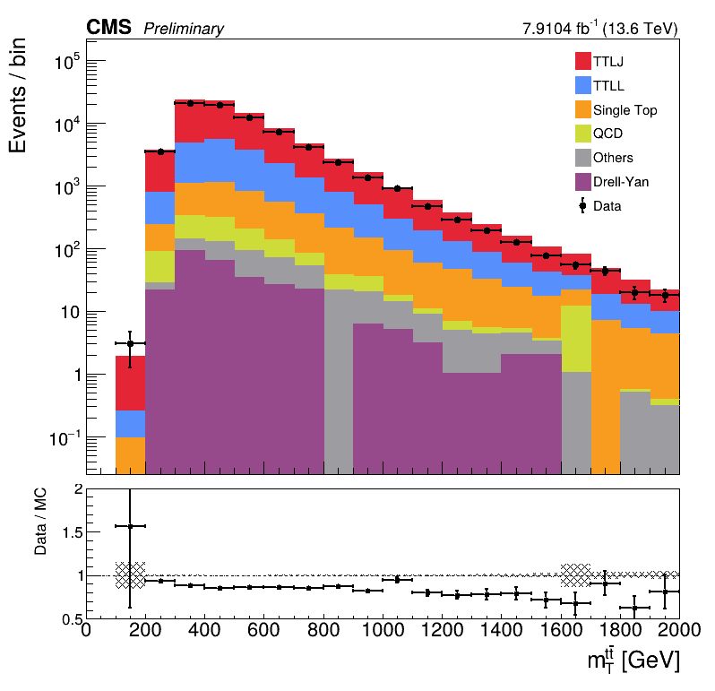
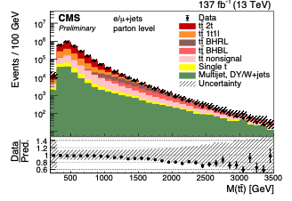

# DATA/SIM

## Drell Yan ( Z -> mu mu )

### Selections 
- HLT        : Isomu24
- safeptcut  : 26
- ID         : POGTIGHT
- pt/eta cut : 30 / 2.4 
- leading , subleading muon , opposite charge 

*Results*
[2022 C,D ERA]

*Reference results*

- SMP 16-009

* Discrepancy reasons : 
  1 . Pt cut 30 makes inv Dilepton inv mass < 60 less precise . 
  1. NO scale factors applied , ~10% diff from data .

## TTBar ( TTLJ )

### Selections 
- HLT        : Isomu24
- safeptcut  : 26
- ID         : POGTIGHT
- pt/eta cut : 30 / 2.4 
- B jet      : ParticleNet Tight / 30 2.4
- light jet  : 30 / 2.4
- MET        : 30

  -> Transverse Mass ( leading Muon + lead,subleading B jet, light jet + MET )

*Results*
[2022 C,D ERA ]

*Reference results*

- TOP 20-001

* Discrepancy reasons : 
  1. More complex states than DY 
  2. Inv mass & transverse Inv mass Diff
  3. Scale factor Diff
  4. Used Boosted , resolved region 
  5. etc ..

---

UsedSample : 

WJets
DYJets
DYJets10to50
TTLJ_powheg
TTJJ_powheg
TTLL_powheg
TTWToLNu
TTZ_M50
TTZ_M4to50
TTZ_NoFullyHad
ST_sch_top_Lep
ST_sch_antitop_Lep
ST_tW_top_Semilep
ST_tW_antitop_Semilep
ST_tW_top_Lep
ST_tW_antitop_Lep
ST_tch_top
ST_tch_antitop
tZq
TTTT
WW_pythia
WZ_pythia
ZZ_pythia
WWW
WWZ
WZZ
ZZZ
ZGToLLG
ggHToZZTo4L
VBFHToZZTo4L
VHToNonbb
TTHToNonbb
tHq
QCD_Pt-15to20_MuEnriched
QCD_Pt-20to30_MuEnriched
QCD_Pt-30to50_MuEnriched
QCD_Pt-50to80_MuEnriched
QCD_Pt-80to120_MuEnriched
QCD_Pt-120to170_MuEnriched
QCD_Pt-170to300_MuEnriched
QCD_Pt-300to470_MuEnriched
QCD_Pt-470to600_MuEnriched
QCD_Pt-600to800_MuEnriched
QCD_Pt-800to1000_MuEnriched
QCD_Pt-1000toInf_MuEnriched
